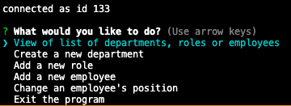

Employee Tracker
==============

## Description 
This is a command line based app that facilitates the creation and management of the  basic structure of a company. A user can add employees, positions with a defined salary, and departments, review them, and then update employee positions. Add information is stored in a database in the repository. 

## Installation
Fork the repository, then navigate to the file in the terminal. 
then
`npm install`
in install the required packages

## Usage 
to start enter `npm start` on the command line

public/assets/images/prompt.png

Users will be prompted through the company profile creation where they can add employees, positions and departments. 

## Credits
I wrote this app myself with vanilla JavaScript. Scripting wise there is not much to the app beyond  a few class constructors, a schema for the db, a separate JS file for the prompt questions and the index.js file that handles the logic and database queries. 

[MySQL](https://www.npmjs.com/package/mysql) is used to create the database and queries.

The command line prompts are handed by the [Inquirer](https://www.npmjs.com/package/inquirer#reactive) npm package. 

I should also credit https://github.com/ElderBass

## License
MIT
